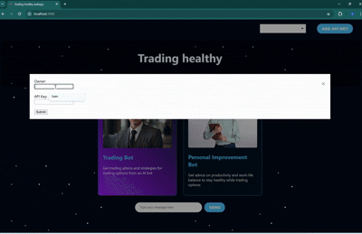

# Trading Healthy webapp - JS

The world of trading options is very dificult to traverse as a beginner, so use OpenAI to get general advice on how to improve yourself as a better trader, but also chat with the personal development bot, to stay healthy and maximize your productivity while trading. Each bot only answers about their expertise.
It utilizes the OpenAI gpt-3.5-turbo model for chat completion.

PS: You need to enter your API key in the top right to use the app, click add api key, then name it whatever you want and save it. You can find your key [here](https://platform.openai.com/api-keys) after you create an account on https://platform.openai.com.

## How to run the app on your local computer

1. Clone the git repo or download as zip.
2. Open the app folder in your favorite IDE.
3. Open your terminal and run `yarn` to install the dependencies of the app.
4. Once this is done, run `yarn start` in your terminal.
5. Your app should now be running in development mode. Visit http://localhost:3000 to view it in your browser.
